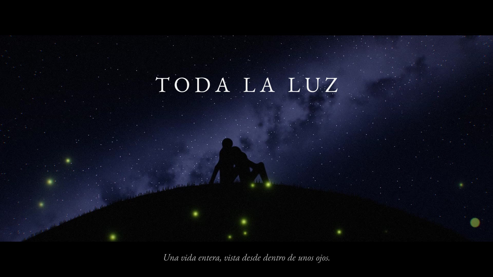

# TODA LA LUZ

Una vida entera en once minutos, vista desde dentro de unos ojos.

Lucía abre los ojos por primera vez y el mundo es una mancha de luz con un rostro que se inclina y le dice *hola*. A partir de ahí aprende a nombrar las cosas, planta un limonero con su abuelo, ve el mar, pierde a alguien por primera vez, recibe una cámara, se enamora, se equivoca, lucha, gana sin tener a quién llamar, tiene una hija, pide perdón, envejece, y al final vuelve a ver el mundo como al principio: borroso, luminoso, con un rostro que se inclina.



- **La película:** [`TODA_LA_LUZ.mp4`](TODA_LA_LUZ.mp4) — 11 min 32 s, 1920×1080 (imagen 2,39:1), estéreo, castellano con subtítulos incrustados.
- Guion: [`film/GUION.md`](film/GUION.md)

## Cómo está hecha

No hay ni un solo clip generado por IA. Todo está construido desde cero en este contenedor:

| Capa | Cómo |
|---|---|
| **Imagen** | 30 planos (23 escenas) escritas como *shaders* GLSL (`film/shaders/`), renderizadas fotograma a fotograma en Chromium sin pantalla (SwiftShader) y pasadas a vídeo con ffmpeg. Un postproceso común (`post.glsl`) da el aspecto de película: halación, aberración cromática, viñeta, grano, curva fílmica. Formato 2,39:1. |
| **Personas** | Siluetas articuladas por funciones de distancia (`sdPose` en `lib.glsl`). Nunca vemos la cara de Lucía: la cámara es ella. |
| **Música** | Partitura original (`film/audio/score.py`): una nana en re mayor que reaparece transformada en cada etapa (arpa de caja de música en la infancia, clarinete en el jardín, violines en el amor, si menor en el duelo, una nota cada vez el último día). Interpretada con muestras reales: Salamander Grand Piano y VSCO-2 Community Edition, mediante un *sampler* escrito para la ocasión (`sampler.py`). |
| **Voces** | Kokoro TTS en local (castellano), con tratamiento por escena: dentro del vientre, a través del teléfono, en un buzón de voz, en la memoria. |
| **Sonido** | Todo sintetizado (`sfx.py`): latidos, respiración, mar, lluvia en el cristal, grillos, tren, ciudad, obturador, aplausos, el zumbido de un fluorescente. |
| **Montaje** | `film/edit.py` define el orden, las transiciones, las edades y los pensamientos de Lucía; `assemble.py` monta y rotula (EB Garamond). |

## Reconstruir

```bash
cd film
npm install                       # playwright
python3 shots.py                  # lista de planos -> shots.json
node render/render.mjs all --jobs 3 --scale 0.75
python3 audio/tts.py && python3 audio/score.py && python3 audio/mix.py
python3 assemble.py
```

Requiere las muestras en `/opt/assets` (Salamander Grand Piano, VSCO-2-CE, modelo Kokoro).
